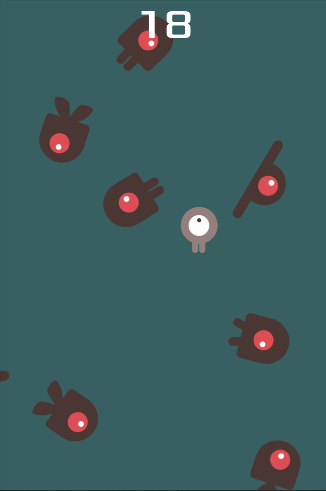

<!-- PROJECT LOGO -->

  
  <h3>Dodge The Creeps</h3>

  

    My first 2D game in Godot!
     
    <a href="https://github.com/MarkDaly64/Dodge-The-Creeps"><strong>Explore the project »</strong></a>
     
     
    <a href="https://github.com/MarkDaly64/Dodge-The-Creeps">View Demo</a>
    ·
    <a href="https://github.com/MarkDaly64/Dodge-The-Creeps/issues">Report Bug</a>
    ·
    <a href="https://github.com/MarkDaly64/Dodge-The-Creeps/issues">Request Feature</a>
  

<!-- TABLE OF CONTENTS -->

  
Table of Contents

  <ol>
    <li>
      <a href="#about-the-project">About The Project</a>
      <ul>
        <li><a href="#built-with">Built With</a></li>
      </ul>
    </li>
    <li>
      <a href="#getting-started">Getting Started</a>
      <ul>
        <li><a href="#prerequisites">Prerequisites</a></li>
        <li><a href="#installation">Installation</a></li>
      </ul>
    </li>
    <li><a href="#how-to-play">How to Play</a></li>
    <li><a href="#credits">Credits</a></li>
  </ol>

<!-- ABOUT THE PROJECT -->
## About The Project

This is a simple game where your character must move and avoid the enemies for as long as possible.

It is the finished version of the game featured in the GDQuest YouTube tutorial 
[Code Your First Complete 2D Game with Godot](https://www.youtube.com/watch?v=WEt2JHEe-do "Your first game").

### Built With

* [Godot](https://godotengine.org/)

(<a href="#top">back to top</a>)

<!-- GETTING STARTED -->
## Getting Started

Instructions on setting up your project locally.
To get a local copy up and running follow these simple example steps.

### Prerequisites

Things you need to use the software and how to install them.
* Godot

   Go to [Godot Engine Official Website](https://godotengine.org/download "Download") and download the standard 64-bit version.

### Installation

1. Go to the [Releases](https://github.com/MarkDaly64/Dodge-The-Creeps/releases "Releases") section of this repostitory and download the zip folder.

2. Open Godot and "Import" the zip file.
   
3. Run the project.

(<a href="#top">back to top</a>)

<!-- HOW TO PLAY -->
## How to Play

* With the project open in Godot, press F5 on your keyboard / click the play button to open the game.
* Click the Start button to begin playing.
* Use the WASD keys to move the player and dodge the creeps.
* Your score increases by 1 point every second you survive.

Click [here](https://github.com/MarkDaly64/Dodge-The-Creeps "Demo") to view the demo.

(<a href="#top">back to top</a>)

<!-- ACKNOWLEDGMENTS -->
## Credits

* This is a copy of a project made by following its video tutorial on the [GDQuest](https://www.youtube.com/watch?v=WEt2JHEe-do "Your first game") channel.
* Visit the creator's [original project repository](https://github.com/GDQuest/godot-getting-started-2021/tree/main/2d-dodge-the-creeps) to see the full list of credits.

(<a href="#top">back to top</a>)

